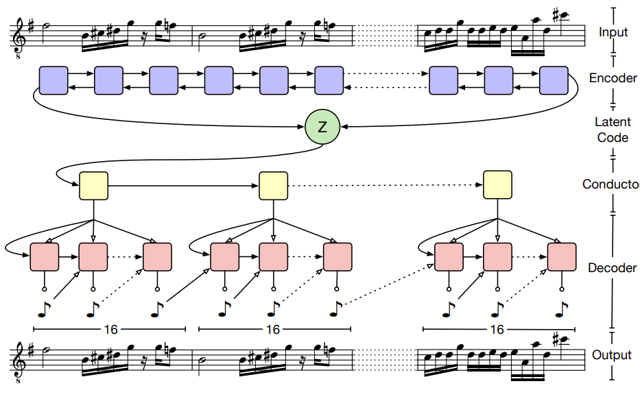

# MusicVAE
Implementation of [MusicVAE](http://proceedings.mlr.press/v80/roberts18a/roberts18a.pdf) in PyTorch 

## MusicVAE overview
- Deep latent variable models such as the Variational Autoencoder (VAE) provides efficient way of producing semantically meaningful latent representations for data.
- VAE shown success on short sequences but had limited ability to model long sequences.
    - Traditional LSTM: unable to decode long sequences, e.g., music because of posterior collapse problem
    - Posterior Collapse: model learns to ignore latent space
- MusicVAE proposed hierarchical decoder in order to decode long sequences in music and solved the posterior collapse problem


## Model
MusicVAE is a Variational Autoencoder (VAE) model which is designed to reconstruct long sequences as in the music. The overall architecture of the model is illustrated below:
)


### Encoder
- The encoder is a two layer bidirectional LSTM with hidden state size of 2048 and output size of 512.
- The encoder's task is to compress the input data into a latent code **z**, which will subsequently be utilized by the hierarchical decoder.

- The implementation of the encoder can be found in **encoder.py**.

### Hierarchical Decoder
- The hierarchical decoder consists of two main module:
    - Conductor: 
        - A two layer unidirectional LSTM with hidden state size of 1024 and output size of 512
        - Generate intermediate interpretation of the latent code **z** for each subsequence. These subsequences are obtained by segmenting the input sequence x into non-overlapping **U** subsequences)
    - Decoder:
        - A two layer LSTM  with hidden size of 1024
        - For each intermediate interpretation, the decoder RNN then autoregressively produces a sequence of distributions over     output tokens using a softmax output layer. 
        - At each time, the input is the concation of current output of the conductor and previous output token of the decoder.
- The implementation of the hierarchical encoder can be found in **decoder.py**.

- The implementation of the MusicVAE can be found in **vae.py**


## Training loss
- The VAE used ELBO loss.
- ELBO loss can be interpreted based on two terms: E[log pθ(x|z)] and KL(qλ(z|x)||p(z))
    - The first term E[log pθ(x|z)] is to ensure accurate reconstruction or  for samples of z from qλ(z|x), p(x|z) is high  
    - The second term KL(qλ(z|x)||p(z)) is to ensure realistic data generation by sampling the latent codes z from p(z).
    - This loss suggests trade off between reconstruction and quality of samples
- The variant of ELBO to control these terms is by introducing KL weight hyperparameter β (Bowman et al., 2016): E[log pθ(x|z)] − β KL(qλ(z|x)||p(z))

- The implementation of variant of ELBO can be found in **loss.py**

## Preprocessing dataset
1. Please download Groove MIDI dataset from this [link](https://magenta.tensorflow.org/datasets/groove) and put the dataset in the root directory.
2. Divide the dataset into three sets: training, validation, and testing. Additionally, preprocess the data into the tfrecord format. To accomplish this, you can execute the provided command.
```
python preprocess.py
```

## Training
- Not fully implemented
- The training function can be found in **train.py**


## Main library
```
pytorch
tensorflow
note_seq

```

## Acknowledgements
The preprocessing part is based on https://github.com/magenta/magenta/tree/main


